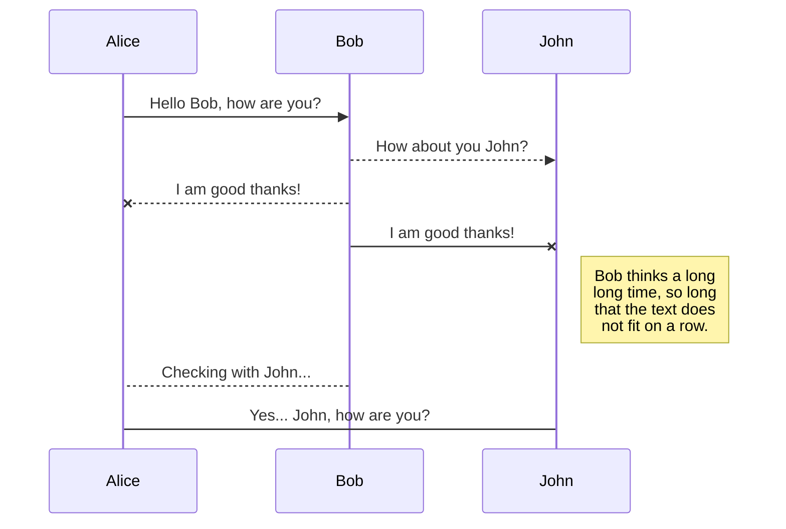
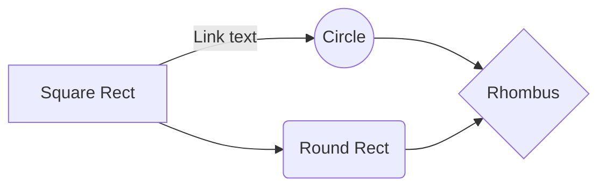

# Welcome to CORD-19 solution

# Approach

Our approach solving CORD-19 research challenge is to 2 folds - 

 1. Reducing the **search space !**
 2. Surface documents based on **similarity rankings**

## Reducing search space

We use search engine to ingest all the 138,000 scholarly articles including 68,000 research articles and ingest most of the metadata with the document - title, abstract and body. Search engine in our case Solr using Lucene indexes help us reduce 138k search space to top 100 documents using tf-idf and idf boosting technique.

### Why Solr?

Solr an open source search platform, provides advanced near real-time searching capabilities such as fielded search, Boolean queries, phrase queries, fuzzy queries, spell check, wildcards, joins, grouping, auto-complete and many more across different types of data.

Solr works by gathering, storing and indexing documents from different sources and making them searchable in near real-time. It follows a 3-step process that involves indexing, querying, and finally, ranking the results – all in near real-time, even though it can work with huge volumes of data.

More specifically, here’s how Solr performs the following operations in a sequence to search for a document:

 1. **Indexing** : As the files are already in JSON format, we can upload them directly to Solr by calling the index request handler (or simply index handler). 
 
Solr uses Lucene to create an inverted index because it inverts a page-centric data structure (documents ⇒ words) to a keyword-centric structure (word ⇒ documents). It’s like the index you see at the end of any book where you can find where certain words occur in the book. Similarly, the Solr index is a list that holds the mapping of words, terms or phrases and their corresponding places in the documents stored.

Solr uses fields to index a document. However, before being added to the index, data goes through a field analyzer, where Solr uses char filters, tokenizers, and token filters to make data searchable. Char filters can make changes to the string as a whole. Then, tokenizers break field data into lexical units or tokens that then pass through filters which decide to keep, transform (e.g. setting all the data to lowercase, removing word stems) or discard them, or create new ones. These final tokens are added to the index or searched at query time. 

 2. **Querying** : We can search for various terms such as keywords, images or geolocation data, for instance. When you send a query, Solr processes it with a query request handles (or simply query handler) that works similarly to the index handler, only that is used to return documents from the Solr index instead of uploading them.  
 
Data indexed in Solr is organized in fields, which are  defined in the Solr Schema [https://lucene.apache.org/solr/guide/8_5/defining-fields.html#defining-fields](https://lucene.apache.org/solr/guide/8_5/defining-fields.html#defining-fields). Searches can take advantage of fields to add precision to queries. For example, you can search for a term only in a specific field, such as a title field. You can specify a different field or a combination of fields in a query.

Solr provides flexibility to boost and control the relevance of a document by boosting the Term. The higher the boost factor, the more relevant the term will be. To boost a term use the caret symbol ^ with a boost factor (a number) at the end of the term you are searching.

For example, if you are searching for, "Impact of Smoking on COVID" and you want the term "Smoking" to be more relevant, you can boost it by adding the ^ symbol along with the boost factor immediately after the term. you could type.

                                               body:Smoking^10.0

                                        << Add query generation code >>

**Code snippet**
To fine tune Solr search to return right subset of documents, we need to identify the right query terms to boost.  This is done by using term’s inverse document frequency (idf), which decreases the weight for commonly used words and increases the weight for words that are not used very much in a collection of documents.
During the document ingestion process we generate the idf dictionary for the entire document corpus that serves as a look up to identify boost parameter values.

 3. **Ranking the Results** : As it matches indexed documents to a query, Solr ranks the results by their relevance score – the most relevant hits appear at the top of the matched documents
 << Add Query response Json example >>

## SmartyPants

SmartyPants converts ASCII punctuation characters into "smart" typographic punctuation HTML entities. For example:

|                |ASCII                          |HTML                         |
|----------------|-------------------------------|-----------------------------|
|Single backticks|`'Isn't this fun?'`            |'Isn't this fun?'            |
|Quotes          |`"Isn't this fun?"`            |"Isn't this fun?"            |
|Dashes          |`-- is en-dash, --- is em-dash`|-- is en-dash, --- is em-dash|

## KaTeX

You can render LaTeX mathematical expressions using [KaTeX](https://khan.github.io/KaTeX/):

The *Gamma function* satisfying $\Gamma(n) = (n-1)!\quad\forall n\in\mathbb N$ is via the Euler integral

$$
\Gamma(z) = \int_0^\infty t^{z-1}e^{-t}dt\,.
$$

> You can find more information about **LaTeX** mathematical expressions [here](http://meta.math.stackexchange.com/questions/5020/mathjax-basic-tutorial-and-quick-reference).

## UML diagrams

You can render UML diagrams using [Mermaid](https://mermaidjs.github.io/). For example, this will produce a sequence diagram:

And this will produce a flow chart:

